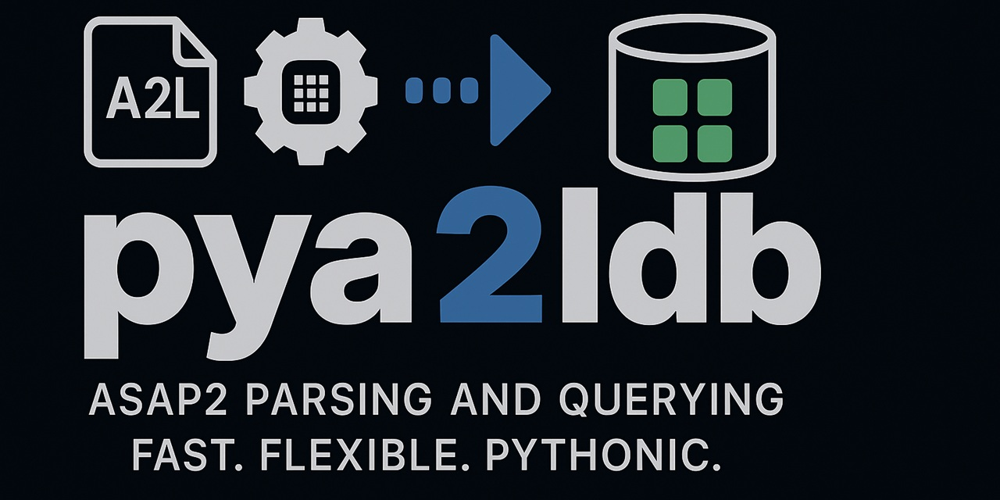

Readme
======

|PyPI| |Python Versions| |License: LGPL v3+| |Code style: black| |Ask DeepWiki| |PDF Manual|

pyA2L is an `ASAM MCD-2MC <https://www.asam.net/standards/detail/mcd-2-mc/>`__ processing
library written in Python.

If you work with ECUs, ASAP2/A2L is the contract that describes what and
how to measure or calibrate. pyA2L helps you parse once, inspect and
validate programmatically, automate checks, and export back when needed
— all from Python.

Contents
--------

- About ASAM MCD-2 MC (ASAP2)
- What pyA2L offers
- Installation
- Getting Started (Quickstart)
- Command-line usage
- Tips
- Examples
- Compatibility
- Project links
- Contributing
- Code of Conduct
- License
- Changelog / Release notes
- Acknowledgements

About ASAM MCD-2 MC (ASAP2)
---------------------------

ASAM MCD-2 MC (ASAP2) is the ASAM standard that defines the A2L
description format for ECU measurement signals and calibration
parameters. In practice, the A2L acts as a contract between ECU software
and tools so different vendors can consistently locate data in memory
and convert raw values into physical engineering units. Runtime
transport (e.g., CCP/XCP) is out of scope of the standard.

For an authoritative overview of the standard, see the ASAM page:
https://www.asam.net/standards/detail/mcd-2-mc/

What pyA2L offers
-----------------

- Parse .a2l files and persist them as compact, queryable SQLite
  databases (.a2ldb) to avoid repeated parse costs.
- Programmatic access to ASAP2 entities via SQLAlchemy ORM models
  (MODULE, MEASUREMENT, CHARACTERISTIC, AXIS_DESCR, RECORD_LAYOUT,
  COMPU_METHOD/COMPU_TAB, UNIT, FUNCTION, GROUP, VARIANT_CODING, etc.).
- Rich inspection helpers in pya2l.api.inspect (e.g., Characteristic,
  Measurement, AxisDescr, ModPar, ModCommon) to compute shapes, axis
  info, allocated memory, conversions, and more.
- Creator API in pya2l.api.create to programmatically build or augment
  A2L content (PROJECT, MODULE, MEASUREMENT, CHARACTERISTIC, COMPU_METHOD,
  AXIS_PTS, RECORD_LAYOUT, GROUP, FUNCTION, etc.).
- Validation utilities (pya2l.api.validate) to check common ASAP2 rules
  and project-specific consistency.
- Export .a2ldb content back to A2L text or JSON when needed.
- Building blocks for automation: reporting, quality gates, CI checks,
  and integration with CCP/XCP workflows.

Supported ASAP2 version: 1.7.1

Why pyA2L?
----------

- Parse once, query fast: Avoid repeated parser runs by working from
  SQLite.
- Powerful model: Use SQLAlchemy ORM to navigate ASAP2 entities
  naturally.
- Beyond parsing: Inspect derived properties, validate consistency, and
  export back to A2L.
- Automate: Integrate with CI to enforce quality gates on A2L content.

Design highlights
-----------------

- **SQLite-backed storage** (.a2ldb) with SQLAlchemy models
- **C++ parser** (ANTLR4-based) for fast parsing (2.5 MB/s)
- **Adaptive flush strategy** automatically tunes performance (10% speedup for large files)
- **High-level inspection helpers** in ``pya2l.api.inspect``
- **Creator API** in ``pya2l.api.create`` for programmatic A2L generation
- **Validator framework** in ``pya2l.api.validate`` yielding structured
  diagnostics
- **Export to A2L text or JSON** format with complete roundtrip fidelity
- **Optional CLI** (``a2ldb-imex``) for import/export tasks
- **Concurrent access** via SQLite WAL mode (multiple readers during export)

Learn more about the standard at the ASAM website:
https://www.asam.net/standards/detail/mcd-2-mc/wiki/

Installation
------------

- Via ``pip``: ``shell   $ pip install pya2ldb`` **IMPORTANT**:
  Package-name is ``pya2ldb`` **NOT** ``pya2l``!!!

- From Github:

  - Clone / fork / download `pyA2Ldb
    repository <https://github.com/christoph2/pya2l>`__.

Getting Started (Quickstart)
----------------------------

Parse once, work from SQLite thereafter.

Import a .a2l file and persist it as .a2ldb (SQLite):

.. code:: python

   from pya2l import DB

   db = DB()
   session = db.import_a2l(
       "ASAP2_Demo_V161.a2l",
       # Optional:
       # encoding="utf-8",        # default is latin-1
       # progress_bar=False,      # silence the progress meter
       # loglevel="ERROR",        # also suppresses progress
   )
   # Creates ASAP2_Demo_V161.a2ldb in the working directory

- Open an existing .a2ldb without re-parsing:

.. code:: python

   from pya2l import DB

   db = DB()
   session = db.open_existing("ASAP2_Demo_V161")  # extension .a2ldb is implied

Query with SQLAlchemy ORM - List all measurements ordered by name with
address and data type:

.. code:: python

   from pya2l import DB
   import pya2l.model as model

   db = DB()
   session = db.open_existing("ASAP2_Demo_V161")
   measurements = (
       session.query(model.Measurement)
       .order_by(model.Measurement.name)
       .all()
   )
   for m in measurements:
       print(f"{m.name:48} {m.datatype:12} 0x{m.ecu_address.address:08x}")

High-level inspection helpers - Use convenience wrappers from
pya2l.api.inspect to access derived info:

.. code:: python

   from pya2l import DB
   from pya2l.api.inspect import Characteristic, Measurement, AxisDescr

   db = DB()
   session = db.open_existing("ASAP2_Demo_V161")
   ch = Characteristic(session, "ASAM.C.MAP.UBYTE.IDENTICAL")
   print("shape:", ch.dim().shape)
   print("element size:", ch.fnc_element_size(), "bytes")
   print("num axes:", ch.num_axes())

   me = Measurement(session, "ASAM.M.SCALAR.UBYTE.IDENTICAL")
   print("is virtual:", me.is_virtual())

   axis = ch.axisDescription("X")
   print("axis info:", axis.axisDescription("X"))

Create A2L content programmatically - Use the Creator API to build or
augment A2L databases:

.. code:: python

   from pya2l import DB
   from pya2l.api.create import (
       ProjectCreator, ModuleCreator, MeasurementCreator,
       CharacteristicCreator, CompuMethodCreator
   )

   db = DB()
   session = db.open_create("MyProject.a2ldb")

   # Create project and module
   pc = ProjectCreator(session)
   project = pc.create_project("MyProject", "Demo ECU Project")

   mc = ModuleCreator(session)
   module = mc.create_module("MyModule", "Demo Module", project=project)

   # Add a conversion method
   cmc = CompuMethodCreator(session)
   cm = cmc.create_compu_method(
       "CM_Voltage", "Voltage conversion", "LINEAR",
       "%6.3", "V", module_name="MyModule"
   )
   cmc.add_coeffs_linear(cm, offset=0.0, factor=0.01)  # y = 0.01*x + 0

   # Add a measurement
   mec = MeasurementCreator(session)
   meas = mec.create_measurement(
       "BatteryVoltage", "Battery voltage in Volts",
       "UWORD", "CM_Voltage", resolution=1, accuracy=0.1,
       lower_limit=0.0, upper_limit=20.0,
       module_name="MyModule"
   )
   mec.add_ecu_address(meas, 0x1000)

   # Add a characteristic (calibration parameter)
   cc = CharacteristicCreator(session)
   char = cc.create_characteristic(
       "InjectionMap", "Fuel injection map",
       "MAP", 0x2000, "RL_InjMap", 0.0, "CM_Voltage",
       0.0, 100.0, module_name="MyModule"
   )

   mc.commit()
   db.close()

Validate your database

.. code:: python

   from pya2l import DB
   from pya2l.api.validate import Validator

   db = DB()
   session = db.open_existing("ASAP2_Demo_V161")
   vd = Validator(session)
   for msg in vd():  # iterate diagnostics
       # msg has fields: type (Level), category (Category), diag_code (Diagnostics), text (str)
       print(msg.type.name, msg.category.name, msg.diag_code.name, "-", msg.text)

Export back to A2L or JSON

.. code:: python

   from pya2l import export_a2l

   # Export to A2L text format
   export_a2l("ASAP2_Demo_V161", "exported.a2l")

   # Or export to JSON for further processing
   from pya2l.imex.json_exporter import export_json
   export_json("ASAP2_Demo_V161.a2ldb", "exported.json")

Tips
----

- Default import encoding is latin-1; override ``encoding=`` if your file differs.
- Silence the progress meter via ``progress_bar=False`` or ``loglevel="ERROR"``.
- Python package name is ``pya2ldb`` (not ``pya2l``).
- See `howto <./howto.rst>`__ for Excel export and other short recipes.

Examples
--------

- See ``pya2l/examples`` for sample A2L files and scripts.
- The Sphinx docs contain a fuller tutorial and HOWTO guides.

Create API and coverage parity
------------------------------

pyA2L offers a Creator API in pya2l.api.create to programmatically build
or augment A2L content. The project’s goal is coverage parity:
everything you can query via pya2l.api.inspect is intended to be
creatable via pya2l.api.create.

Example: creating common entities

.. code:: python

   from pya2l import DB
   from pya2l.api.create import ModuleCreator
   from pya2l.api.inspect import Module

   # Open or create a database
   session = DB().open_create("MyProject.a2l")  # or .a2ldb

   mc = ModuleCreator(session)
   # Create a module
   mod = mc.create_module("DEMO", "Demo ECU module")

   # Units and conversions
   temp_unit = mc.add_unit(mod, name="degC", long_identifier="Celsius",
                           display="°C", type_str="TEMPERATURE")
   ct = mc.add_compu_tab(mod, name="TAB_NOINTP_DEMO", long_identifier="Demo Tab",
                         conversion_type="TAB_NOINTP",
                         pairs=[(0, 0.0), (100, 1.0)], default_numeric=0.0)

   # Frames and transformers
   fr = mc.add_frame(mod, name="FRAME1", long_identifier="Demo frame",
                     scaling_unit=1, rate=10, measurements=["ENGINE_SPEED"])
   tr = mc.add_transformer(mod, name="TR1", version="1.0",
                           executable32="tr32.dll", executable64="tr64.dll",
                           timeout=1000, trigger="ON_CHANGE", inverse="NONE",
                           in_objects=["ENGINE_SPEED"], out_objects=["SPEED_PHYS"])

   # Typedefs and instances
   ts = mc.add_typedef_structure(mod, name="TSig", long_identifier="Signal",
                                 size=8)
   mc.add_structure_component(ts, name="raw", typedefName="UWORD", addressOffset=0)
   inst = mc.add_instance(mod, name="S1", long_identifier="Inst of TSig",
                          type_name="TSig", address=0x1000)

   # Verify with inspect helpers
   mi = Module(session)
   print("#frames:", len(list(mi.frame.query())))
   print("#compu tabs:", len(list(mi.compu_tab.query())))

See pya2l/examples/create_quickstart.py for a more complete example.

Command-line usage
------------------

A small CLI is provided as a console script named ``a2ldb-imex``:

.. code:: bash

   # Show version
   $ a2ldb-imex -V

   # Import an A2L (creates .a2ldb next to the input or in CWD with -L)
   $ a2ldb-imex -i path/to/file.a2l

   # Import with explicit encoding and create DB in current directory
   $ a2ldb-imex -i path/to/file.a2l -E latin-1 -L

   # Export an .a2ldb back to A2L text (stdout by default or -o file)
   $ a2ldb-imex -e path/to/file.a2ldb -o exported.a2l

Compatibility
-------------

- Python: 3.10 – 3.14
- Platforms: Prebuilt wheels are published for selected platforms. From
  source, Windows/macOS are supported; Linux may require building native
  extensions.

Project links
-------------

- Source code: https://github.com/christoph2/pyA2L
- Issue tracker: https://github.com/christoph2/pyA2L/issues
- PyPI: https://pypi.org/project/pya2ldb/
- `Documentation <index.rst>`__
- `PDF Manual <https://pya2l.readthedocs.io/_/downloads/en/latest/pdf/>`__

Contributing
------------

Contributions are welcome! Please open an issue to discuss significant
changes before submitting a PR. See the existing tests under
``pya2l/tests`` and examples under ``pya2l/examples`` to get started.
Contributors should use pre-commit to run formatting and lint checks
before committing; see https://pre-commit.com/ for installation and
usage.

Code of Conduct
---------------

This project follows a Code of Conduct to foster an open and welcoming
community. Please read and abide by it when interacting in issues,
discussions, and pull requests.

See `CODE_OF_CONDUCT <../CODE_OF_CONDUCT.md>`__ for full details.

Changelog / Release notes
-------------------------

See GitHub Releases: https://github.com/christoph2/pyA2L/releases

.. |CI| image:: https://github.com/christoph2/pya2l/workflows/Python%20application/badge.svg
   :target: https://github.com/christoph2/pya2l/actions
.. |PyPI| image:: https://img.shields.io/pypi/v/pya2ldb.svg
   :target: https://pypi.org/project/pya2ldb/
.. |Python Versions| image:: https://img.shields.io/pypi/pyversions/pya2l.svg
   :target: https://pypi.org/project/pya2ldb/
.. |License: LGPL v3+| image:: https://img.shields.io/badge/License-LGPL%20v3%2B-blue.svg
   :target: https://www.gnu.org/licenses/lgpl-3.0
.. |Code style: black| image:: https://img.shields.io/badge/code%20style-black-000000.svg
   :target: https://github.com/psf/black
.. |Ask DeepWiki| image:: https://deepwiki.com/badge.svg
   :target: https://deepwiki.com/christoph2/pyA2L
.. |PDF Manual| image:: https://img.shields.io/badge/docs-PDF%20manual-blue.svg
   :target: https://pya2l.readthedocs.io/_/downloads/en/latest/pdf/
