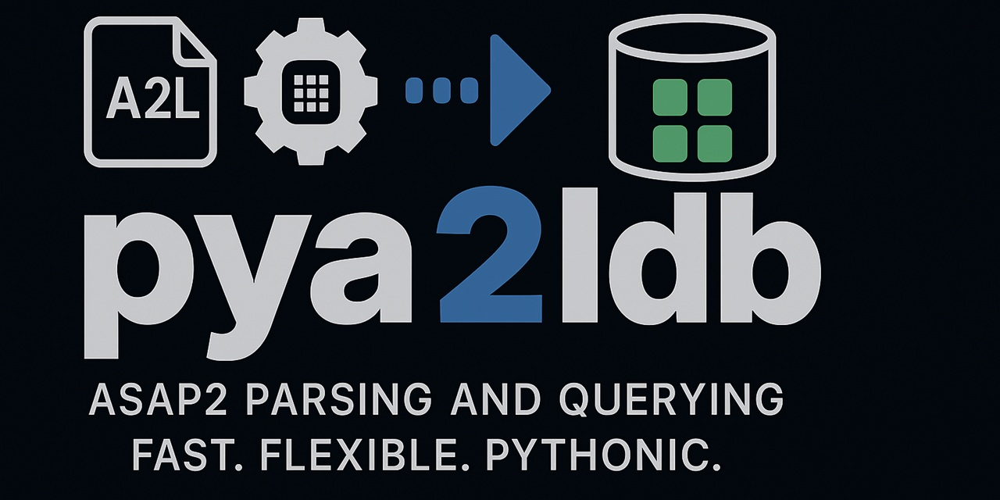

Welcome to pyA2L's documentation
================================

pyA2L is a Python toolkit for working with ASAM MCD-2 MC (ASAP2) A2L files. The library parses A2L into a SQLite-backed model, provides inspection and validation utilities, and enables automation around ECU measurement and calibration metadata.

For background on the ASAP2 standard, see: https://www.asam.net/standards/detail/mcd-2-mc/wiki/

.. toctree::
   :maxdepth: 2
   :caption: Contents:

   README
   getting_started
   installation
   building
   configuration
   tutorial
   howto
   faq
   modules

Indices and tables
==================

* :ref:`genindex`
* :ref:`modindex`
* :ref:`search`
